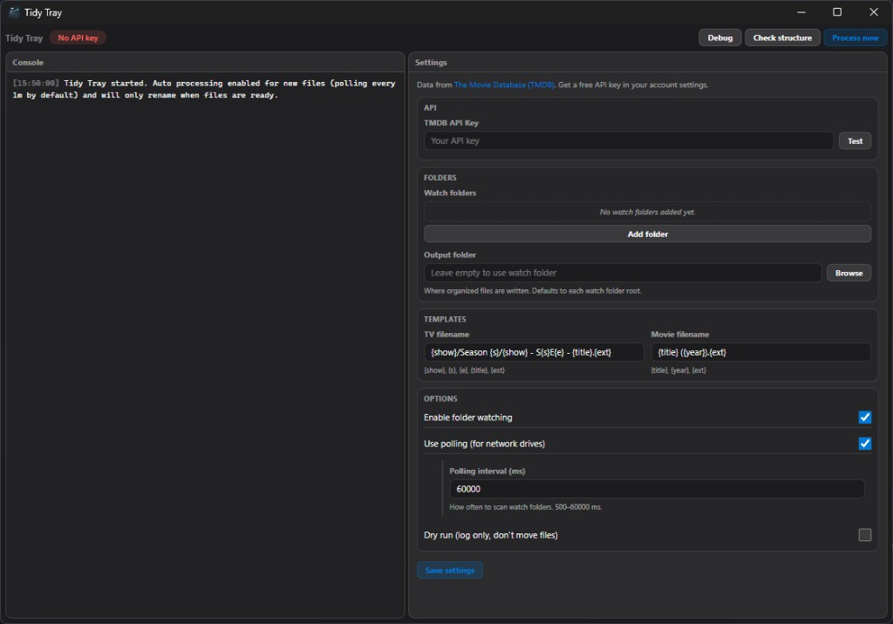

# CineTray

**Automatic movie & TV file renamer for Plex, Jellyfin, and Kodi**

[](https://github.com/taylorivanoff/cinetray/releases)
[](https://github.com/taylorivanoff/cinetray/releases)
[](LICENSE)

CineTray is a lightweight **FileBot alternative** that runs in your system tray, watches download folders, and automatically renames and organizes movie and TV files using [The Movie Database (TMDB)](https://www.themoviedb.org). Match messy release names to proper titles, sort into Plex-compatible folders, and log every change — without scripts or a heavy media manager.

One window covers settings, sync actions, and a live console. Turn on the folder watcher for hands-off processing, or click **Process now** for a manual backfill.

## Features

- **Background folder watching** — auto-processes new downloads (60s polling by default)
- **Plex-compatible output** — configurable TV and movie filename templates
- **TMDB lookup** — resolves show, season, episode, and movie metadata
- **Dry run mode** — preview renames without moving files
- **File-ready safety** — skips locked or in-progress downloads until stable
- **Structure checker** — finds naming/layout issues in your library folders
- **System tray app** — close hides to tray; quick access to process and console
- **Combined UI** — console, settings, and actions in one place
- **Debug log strip** — toggle a compact log panel above the console
- **Windows startup** — optional auto-launch on login (disable in Settings → Apps → Startup)

## Screenshots

Main app window:



## What It Does

1. Watches incoming folders for media files (`.mkv`, `.mp4`, `.avi`, `.mov`, `.wmv`, `.m4v`, `.webm`)
2. Parses TV episodes and movies from common release-name patterns
3. Looks up titles and episode names in TMDB
4. Renames and moves files using your templates
5. Logs every action in the embedded console

**Example output**

- TV: `Show Name/Season 01/Show Name - S01E05 - Episode Title.mkv`
- Movie: `Movie Name (2024).mkv`

## Requirements

- Windows or macOS
- A free [TMDB API key](https://www.themoviedb.org/settings/api)

## Installation

### Windows

1. Download `cinetray-Setup-<version>.exe` from [Releases](https://github.com/taylorivanoff/cinetray/releases)
2. Run the installer

### macOS

1. Download the `.dmg` from [Releases](https://github.com/taylorivanoff/cinetray/releases) and drag **CineTray** to Applications
2. If macOS blocks the app as “damaged”, open **System Settings → Privacy & Security** and click **Open Anyway** — this is Gatekeeper on an unsigned build, not a corrupt file

## Usage

1. Launch CineTray (the window opens on first run if the API key or watch folders are missing)
2. Add your TMDB API key and click **Test** — if the key is valid, it is saved automatically and the field loses focus
3. Add one or more watch folders
4. Optionally set an output folder (leave blank to organize in place under each watch root)
5. Review templates and click **Save settings** (for watch folders, templates, and other options — the API key does not need a separate save after a successful test)
6. Click **Process now** for a manual scan, or let the watcher handle new files
7. Click **Debug** to show or hide the compact log strip
8. Use **Check structure** to scan output folders for naming/layout issues

### Processing modes

**Automatic** — triggered by new or changed files in watch folders. Uses polling (default 60 seconds). Skips files that appear locked or in-progress and retries on later events.

**Manual** — runs a deeper scan of watch folders. Useful for backfills and cleanup. Performs pre-scan structure checks and logs findings.

## Filename Detection

CineTray parses common patterns:

- TV:
  - `Show.Name.S01E05.*`
  - `Show.Name.1x05.*`
  - `Show Name s01e05 ...`
- Movies:
  - `Movie.Name.2024.*`
  - similar names containing a 4-digit year

The parsed title is used as the TMDB query.

## Templates

Default TV template:

`{show}/Season {s}/{show} - S{s}E{e} - {title}.{ext}`

Default movie template:

`{title} ({year}).{ext}`

Supported placeholders:

- TV: `{show}`, `{s}`, `{e}`, `{title}`, `{ext}`
- Movie: `{title}`, `{year}`, `{ext}`

## Upgrading from Tidy Tray

CineTray is the new name for Tidy Tray. If you used the old app:

1. Install CineTray from [Releases](https://github.com/taylorivanoff/cinetray/releases) — in-place auto-update from Tidy Tray is not supported because the app ID changed
2. Your settings (API key, watch folders, templates) migrate automatically from `%AppData%\Tidy Tray\` on first launch
3. Uninstall Tidy Tray when you're satisfied everything works

The old repo redirects here: [github.com/taylorivanoff/cinetray](https://github.com/taylorivanoff/cinetray)

## Development

```bash
git clone https://github.com/taylorivanoff/cinetray.git
cd cinetray
npm install
npm start
```

Or with Bun:

```bash
bun install
bun start
```

### Building

```bash
npm run release
```

Build artifacts land in `dist/`. Packaged builds check for updates from GitHub Releases.

## Tech Stack

- [Electron](https://www.electronjs.org/)
- [electron-tray-base](https://github.com/taylorivanoff/electron-tray-base) — tray, window, splash, settings IPC
- [TMDB API](https://www.themoviedb.org/documentation/api)
- [chokidar](https://github.com/paulmillr/chokidar)
- [electron-store](https://github.com/sindresorhus/electron-store)

## Attribution

This product uses the [TMDB API](https://www.themoviedb.org/documentation/api) but is not endorsed or certified by TMDB.

## Contributing

Contributions are welcome! Please feel free to submit a Pull Request.

## License

MIT. See [LICENSE](LICENSE).
